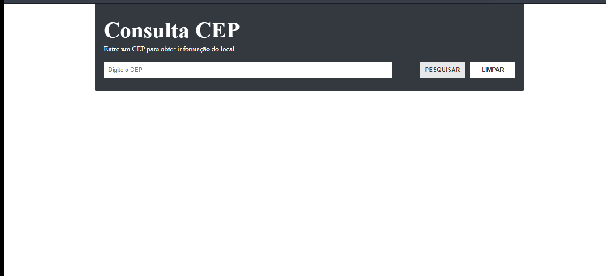

# consultar-cep

<h1 align="center"> Sobre o projeto </h1>

 Uma página web simples onde o usuário insere um cep e consultando uma API, é retornado informações a respeito do cep digitado. 

<h2 align="center"> Tecnologias Utilizadas </h2>

 Foram utilizados HTML, CSS com SASS e Javascript.

 O javascript é responsável por pegar o valor digitado pelo usuário, fazer verificação com esse valor, fazer uma requisição na api para pegar os dados do cep digitado e colocar esses dados na tela. 

<h2 align="center"> Autor </h2>
<strong> Hamilton de Souza </strong>
 

